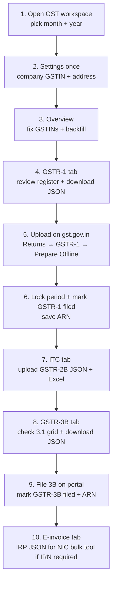
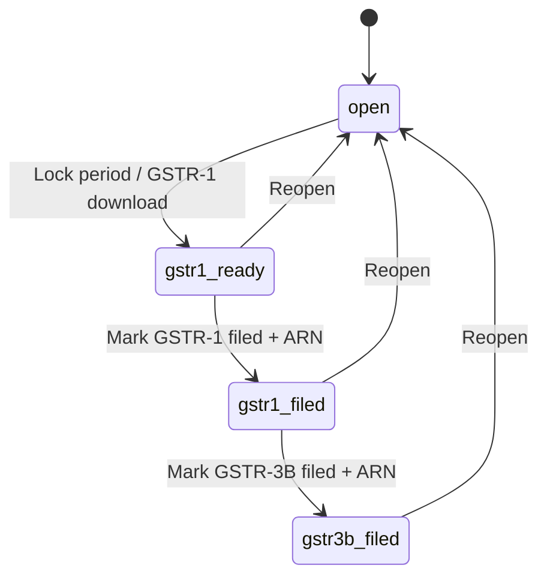

# SimpliPharma GST Workspace — CA how-to guide

**Audience:** Chartered accountant / tax team preparing GSTR-1, GSTR-3B, ITC, and e-invoice JSON from SimpliPharma Admin.

**What this app does:** Classifies sales, credit notes, debit notes, and purchases for a GST month, then downloads **offline GSTN JSON** you upload on [gst.gov.in](https://www.gst.gov.in).

**What this app does not do:** It does **not** file the return, generate an IRN from NIC, pull GSTR-2B live, or collect GSTN passwords.

Issued invoice numbers and rupee totals are **never rewritten**. Snapshots only add GST classification (`B2B` / `B2CS` / `B2CL`, CGST/SGST vs IGST, HSN).

---

## 1. Monthly picture (start here)

**Rule of thumb:** Overview until the orange badges are gone → GSTR-1 JSON → portal → lock → 3B / ITC.

---

## 2. How to open it

1. Sign in to **SimpliPharma Admin**.
2. In the left menu, open **GST → GST workspace** (path `/gst`).
3. You need the permission **Can edit GST settings** to save settings, backfill, lock, or mark filed. Without it you can still **view and download**.

At the top of every GST screen:

| Control | What it does |
|---|---|
| **Month / Year** | GST return period (Indian calendar month, IST). Example: April 2026 → GSTR `fp` `042026`. |
| **Status chip** | `open` → `gstr1 ready` (locked) → `gstr1 filed` → `gstr3b filed`. |
| **Lock period** | Stops backfill and new bills **dated in this month**. |
| **Reopen** | Unlocks so you can backfill or correct books. Use only if the portal file was not the final one. |
| **Mark GSTR-1 / 3B filed** | After you file on gst.gov.in. Optional **ARN** is stored on the period. |
| **Settings** | Company GSTIN, legal name, address, state, filing frequency, e-invoice flag. |
| **Tabs** | Overview · GSTR-1 · GSTR-3B · ITC / GSTR-2B · E-invoice. Orange badges = documents still missing a GST snapshot. |

---

## 3. One-time: company GST settings

Open **Settings** (top right of the GST bar).

Fill:

- Legal name, trade name, **15-character GSTIN**, address, state + state code, pincode, phone, email, drug licence
- **Filing frequency:** Monthly or QRMP (quarterly). QRMP only sets `filing_typ: Q` on the JSON; you still pick a **month** for the books.
- **E-invoice (IRN) required:** Turn on only if turnover requires IRN. This **enables IRP JSON download**. It does **not** call NIC.

Click **Save settings**. Invalid GSTIN format is rejected (15 characters, standard Indian pattern). There is no check-digit / GSTN API validation.

---

## 4. Overview — clean the books before export

This is the exception queue for the selected month.

### 4.1 Cards

- **Company GSTIN** — from settings.
- **This month — invoiced orders** — how many sales invoices exist vs how many already have a GST snapshot.
- **Master-data exceptions** — stores/vendors with invalid GSTIN; medicines with no HSN (`code`).

### 4.2 Exception actions

| Severity | Typical message | What you do |
|---|---|---|
| Info | N sales / CN / DN / PI have no GST snapshot | **Preview & backfill** |
| Warning | Store has no GSTIN | **Fix GSTIN** — blank is allowed (those invoices classify as B2C) |
| Error | Store / vendor GSTIN is not 15 characters | **Fix GSTIN** |
| Warning | Medicines have no HSN | **Open inventory** and fill medicine **code** (HSN). New lines without HSN use **300490**. |

Fix GSTINs **before** backfill when you can. Backfill uses the GSTIN on the store/vendor **at the time you run it**. Changing a GSTIN later does **not** rewrite old snapshots.

### 4.3 Backfill (historical invoices)

1. Click **Process this period** or **Preview & backfill**.
2. Read the preview: count of sales invoices, credit notes, debit notes, purchase invoices, plus a sample of CGST/SGST split.
3. Confirm. The system **only writes a `gst` snapshot**. Invoice numbers and tax rupees stay as billed.

Backfill is **faithful to the issued bill**: it splits the **existing tax** as intra-state CGST + SGST (place of supply = company state). It does **not** re-rate mixed 5% / 12% lines on old invoices.

**New** fulfilments, credit/debit notes, and purchase invoices (after this GST module) store **line-level HSN, rate, taxable, tax**. Those export as one GSTR-1 `itm` **per GST rate**.

If the period is locked, backfill is blocked until you **Reopen**.

---

## 5. GSTR-1 — outward supplies JSON

Tab **GSTR-1**.

### 5.1 What you see

- Counts: B2B, B2CL, B2CS rows, CDNR, CDNUR, HSN rows
- GSTIN, filing period `fp`, document count
- SHA-256 hash and file size after the JSON is built
- Warnings (e.g. documents skipped because they have no snapshot)
- **Invoice register** — number, date, type, party, rates, taxable, tax, total (first 400 rows)

### 5.2 Classification used in the file

| Type | Meaning in this app |
|---|---|
| **B2B** | Buyer GSTIN is valid 15 characters |
| **B2CL** | Unregistered, inter-state, invoice value ≥ **₹1 lakh** (threshold from **August 2024**) |
| **B2CS** | Other B2C (including small inter-state) |
| **CDNR** | Credit / debit note to a registered buyer |
| **CDNUR** | Credit / debit note to unregistered |

JSON version: **GST3.2.1**. Document numbers are cleaned to GSTN-safe characters (max 16). Mixed-rate invoices emit **one item per rate**. Files over **5 MB** are rejected (GSTN limit).

### 5.3 Download and upload on the portal

1. If the register is empty or a warning says snapshots are missing → go back to Overview and backfill.
2. Click **Download GSTR-1 JSON**.
3. Confirm **Lock this period** when asked (recommended after you are happy with the file). Lock stores:
   - filename
   - SHA-256 hash
   - slim invoice fingerprints (for later amendments)
4. On **gst.gov.in**:
   - Returns Dashboard → **GSTR-1**
   - **Prepare Offline** (or Offline Utility)
   - Upload the downloaded `returns_MMYYYY_GSTR1_<GSTIN>.json`
   - Validate in the GSTN offline tool, then file on the portal
5. Back in the app: **Mark GSTR-1 filed** and paste the **ARN** (optional but useful for audit).

This download **does not file**. Filing happens only on gst.gov.in.

### 5.4 Amendment JSON

After a period has been locked once, **Download amendment JSON** builds B2BA / CDNRA only for invoices whose fingerprint **changed** since lock (number, date, totals, type, GSTIN). Unchanged invoices are omitted.

B2CS cannot go in amendment tables in this exporter — include those in an original GSTR-1 if needed.

---

## 6. Period lock (important)

While status is **not** `open`:

- You **cannot** fulfil a sales order **dated in that month**
- You **cannot** create a credit note, debit note, purchase invoice, or purchase return **dated in that month**
- You **cannot** backfill that month

**Reopen** only if you must correct books and regenerate JSON. After reopen, download GSTR-1 again and re-upload on the portal if you already filed.

---

## 7. ITC / GSTR-2B

Tab **ITC / GSTR-2B**.

The app **cannot pull 2B from GSTN**. You download 2B JSON from the portal, then match here.

1. On gst.gov.in, download **GSTR-2B** JSON for the same period.
2. Click **Upload GSTR-2B JSON**.
3. Review match status:

| Status | Meaning |
|---|---|
| **matched** | Same vendor GSTIN + invoice number; taxable/tax within ₹1 |
| **amount mismatch** | Found on both sides, figures differ |
| **books only** | In SimpliPharma, not in the uploaded 2B (or vendor GSTIN missing) |
| **portal only** | In 2B, not in this month’s purchase books |

4. Eligible ITC shown is from **inward snapshots with a valid vendor GSTIN**. Purchase returns reverse ITC.
5. **Download ITC Excel** for working papers.

ITC is **not auto-claimed** on the portal. Use this as a reconciliation worksheet, then enter / confirm GSTR-3B ITC on gst.gov.in.

---

## 8. GSTR-3B

Tab **GSTR-3B**.

### 8.1 Table 3.1 worksheet (on screen)

| Row | Source in this app |
|---|---|
| **(a) Outward taxable supplies** | Sales invoices + debit notes − credit notes (from snapshots) |
| **(b) Zero rated** | Always 0 |
| **(c) Nil / exempt** | Always 0 |
| **(d) Reverse charge inward** | Always 0 |
| **(e) Non-GST outward** | Always 0 |

**ITC (OTH)** = purchase invoices with valid vendor GSTIN, net of purchase returns.

Reverse charge, imports, ISD, and nil supplies are **not captured** in SimpliPharma. Add those **manually on the portal** if they apply.

### 8.2 Download and file

1. Review the 3.1 grid vs your GSTR-1 and 2B workings.
2. **Download GSTR-3B JSON**.
3. Upload on gst.gov.in → Returns → **GSTR-3B**. Confirm 3.1 / 4 (ITC) on the portal.
4. After filing: **Mark GSTR-3B filed** and save **ARN**.

---

## 9. E-invoice (IRP JSON)

Tab **E-invoice**.

- Only runs if **E-invoice (IRN) required** is on in Settings.
- Downloads IRP JSON (**version 1.1**) for **B2B** invoices that have a GST snapshot.
- Upload that file in the **NIC / e-invoice bulk / taxpayer tool**.
- The app **does not** generate an IRN, does not call NIC, and does not create e-way bills.

Do this **before or as** you issue B2B invoices if IRN is mandatory for the entity. IRN is **not** written back onto the SimpliPharma invoice in this version.

---

## 10. What lands in GST automatically (going forward)

| Document | When snapshot is written |
|---|---|
| Sales invoice | Order fulfilment (if the invoice month is still **open**) |
| Credit note (return / ledger) | When the note is issued |
| Debit note (ledger) | When the note is issued |
| Purchase invoice | When the PI is saved |
| Purchase return | When the PR is saved |

Each new snapshot stores seller/buyer GSTIN, supply type (intra/inter), invoice type, taxable, CGST/SGST/IGST, and **line HSN / rate / taxable / tax** where lines exist.

---

## 11. CA checklist (print this)

**Before the 11th (GSTR-1 monthly)**

- [ ] Month/year correct on the GST bar
- [ ] Company GSTIN and state code in Settings
- [ ] Store / vendor GSTINs fixed on Overview
- [ ] Backfill run; orange badges at or near zero
- [ ] GSTR-1 register reviewed (types, rates, HSN)
- [ ] GSTR-1 JSON downloaded and validated in GSTN offline tool
- [ ] Uploaded and filed on gst.gov.in
- [ ] Period locked; GSTR-1 marked filed; ARN saved

**Before GSTR-3B due date**

- [ ] GSTR-2B JSON uploaded on ITC tab; mismatches explained
- [ ] ITC Excel archived
- [ ] GSTR-3B 3.1 grid agrees with GSTR-1 (net of notes)
- [ ] Manual 3B rows added on portal if RCM / import / ISD / nil apply
- [ ] GSTR-3B JSON uploaded / figures keyed; return filed
- [ ] GSTR-3B marked filed; ARN saved

**If IRN is applicable**

- [ ] E-invoice JSON downloaded for B2B and processed in NIC tool

---

## 12. Troubleshooting

| Symptom | Likely cause | Action |
|---|---|---|
| “Nothing to export. Backfill this period first.” | No snapshots | Overview → Process this period |
| GSTR-1 warning: N documents have no snapshot | Legacy bills | Backfill; then refresh GSTR-1 |
| Cannot fulfil / save PI in a past month | Period locked | Reopen **only if** you intend to re-export |
| Invoice classified B2C unexpectedly | Store GSTIN blank or invalid **when snapshot was written** | Fix GSTIN, then only **new** invoices pick it up (old snapshots stay) |
| Mixed 5% and 12% on an **old** invoice show as one rate | Backfill is header-level | Accept for history; new fulfilments are line-level |
| ITC not claimed | Vendor GSTIN missing/invalid on the PI | Fix vendor GSTIN **before** creating the PI, or note it as ineligible |
| File larger than 5 MB | Very large month | Split is not supported in-app; contact ops (GSTN hard limit) |
| E-invoice button disabled | Flag off in Settings, or no B2B snapshots | Enable e-invoice; backfill / fulfil B2B |

---

## 13. What you should never expect this screen to do

- File GSTR-1 or GSTR-3B by itself
- Log in to GSTN / store portal passwords
- Generate IRN or e-way bill numbers
- Recalculate or change a bill that already went to the retailer
- Fill 3B reverse charge, imports, or ISD from operations data
- Prove a GSTIN with the official check digit or GSTN search

---

## 14. Who to ask internally

| Topic | Owner |
|---|---|
| Login, GST permission, locking a period | SimpliPharma admin / ops |
| Store / vendor GSTIN, HSN on medicines | Ops / master data |
| Issued invoice vs snapshot mismatch | Ops (do not edit tax on a processed invoice for GST) |
| Portal filing, ARN, 2B download | CA / tax team (you) |

---

*SimpliPharma Admin · GST workspace · Offline GSTN JSON (GSTR-1 GST3.2.1, GSTR-3B, GSTR-2B match, IRP 1.1). Amounts on issued documents are not rewritten.*
